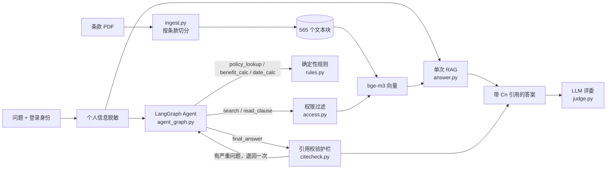

# Insurance RAG Eval

面向中文重疾险条款的问答系统，按“先评测、后优化”的方式构建：每一次改动都先在固定的评测集上量化，再决定要不要保留。

- 语料：3 款公开的重疾险条款，加上中国保险行业协会的《重大疾病保险的疾病定义使用规范（2020 年修订版）》，共 565 个文本块。
- 系统：两种问答方式。
  - 单次 RAG：检索、扩展上下文，然后生成带引用的答案。
  - 检索 Agent：用 LangGraph 实现，工具有检索、按条款号读原文、保单查询、赔付计算、日期计算。
- 安全：权限在检索之前过滤，按租户隔离；个人信息先脱敏再交给模型。
- 评测：89 条用例。答案对不对、有没有编造，由 LLM 评委分开判定；评委本身先做过校准。
- 数据：客户、保单、身份全部是合成数据，不含任何真实客户信息。

## 结果速览

| 评测集 | 单次 RAG | Agent（a2 + 引用护栏） | 说明 |
|---|---|---|---|
| golden_v2（33 题，开发集） | 28/30 可回答题正确，拒答 3/3 | 29/30，拒答 3/3 | 用来调参，数字偏乐观 |
| golden_blind_v1（18 题） | 7/14，拒答 4/4 | 12/14，拒答 4/4 | 后来参与了提示词设计，已被污染 |
| **golden_blind_v2（16 题）** | **10/12**，拒答 3/4 | **9/12**，拒答 4/4 | 唯一没参与过任何决策的集合 |
| 忠实度（没有编造） | 三个集合都是 100% | 97%～100% | 失败的 1 题是评委看不到资料范围导致的误判 |

- 检索（前 5 名命中率 Hit@5）：
  - 在 golden_v1 上，bge-m3 向量检索 96.6%，手写 BM25 62.1%，两者等权 RRF 融合反而降到 79.3%（见 `reports/fusion_v2_summary.md`）。
  - 向量检索在其他集合上：golden_v2 93.3%，blind_v1 85.7%，blind_v2 91.7%。
- 工具任务 10/10，安全用例 12/12。12 条安全用例里，模型在 4 条中真的发起了越权调用（查别人的保单、查其他公司的条款），全部被工具层拦了下来。
- 成本与延迟（每千题按官方 API 列表价换算）：
  - 单次 RAG 约 $0.7～1.1，中位延迟 4～6 秒。
  - Agent 约 $1.8～3.3，中位延迟 8～13 秒。
  - 评委比被评的系统更贵，每千题 $5.5～13。
- **主要结论**：Agent 在 blind_v1 上的明显优势，到 blind_v2 上没有复现。现在的判断是：简单题用单次 RAG 就够了，Agent 只值得用在跨条款和多条件的问题上。详见 `reports/blind_v2_summary.md`。

各实验结论在 `reports/*_summary.md`；评测设计见 [docs/eval_design.md](docs/eval_design.md)，改进前后对比见 [docs/before_after.md](docs/before_after.md)。

## 架构



## 复现

一共分四级，每一级都比上一级多要求一些东西。脚本会把结果写回 `reports/` 下原来的文件名，跑完后用 `git diff reports/` 就能看出和已提交的结果有没有差别。

```bash
docker compose run --rm app offline
```

不需要数据，也不需要 key。它会跑单元测试（需要数据的用例会自动跳过），再根据仓库里的运行结果重新计算延迟、成本和错误率。

```bash
docker compose run --rm app data
```

这一级会从官网下载 4 份公开的 PDF，用 `dataset/sources_sha256.txt` 校验版本，然后切分文本（切分结果要和报告用的哈希一致），最后跑 BM25 检索评测。PDF 不随仓库分发：公开可以下载，不等于允许转载。

```bash
docker compose --profile embed run --rm embed
```

这一级在 CPU 上计算 bge-m3 向量。第一次运行会下载约 2.3GB 的模型，存到 `hf-cache` 卷里。算完向量后，再运行下面的命令做向量检索评测：

```bash
docker compose run --rm app dense-eval
```

```bash
docker compose --profile llm run --rm llm
```

这一级需要先把 `.env.example` 复制成 `.env` 并填上 key。它会在 blind_v2 上跑单次 RAG、Agent 和评委，大约 80 次生成调用、32 次评委调用。key 只在运行时从 `.env` 读取，不会打进镜像。换了模型或服务商之后，缓存对不上，结果和报告里的数字不一定一致。

不用 Docker 的话，本地环境是 Python 3.12 加 `uv`（`uv sync --locked`），然后运行 `sh scripts/reproduce.sh <级别>`。向量相关的步骤需要另一个装了 PyTorch 和 sentence-transformers 的环境。

## 目录

| 路径 | 内容 |
|---|---|
| `src/ingest.py` | PDF 解析、清洗，按条款结构切分 |
| `src/bm25.py`、`src/evaluate.py` | 手写 BM25，检索评测（Hit@k、Recall@k、MRR） |
| `src/embed.py`、`src/embed_server.py`、`src/rerank.py` | 向量计算、本地向量服务、交叉编码器重排实验 |
| `src/answer.py` | 单次 RAG：上下文扩展、提示词 p1/p2、带缓存的 LLM 客户端 |
| `src/agent.py`、`src/agent_graph.py` | 手写循环版和 LangGraph 版 Agent（已用 100% 缓存命中证明两者等价） |
| `src/citecheck.py` | 引用校验：数字事实是否能在它引用的块里找到 |
| `src/rules.py` | 赔付计算规则，每条规则都带条款原文依据，由测试校验 |
| `src/access.py`、`src/privacy.py` | 权限与租户隔离、个人信息脱敏 |
| `src/judge.py`、`src/judge_adversarial.py` | LLM 评委和评委的对抗测试 |
| `src/eval_tools.py`、`src/eval_security.py`、`src/ops_report.py` | 工具任务、安全用例、运行指标 |
| `dataset/` | 评测集（每题附条款原文摘录）、合成保单和身份、来源清单和校验和 |
| `reports/` | 每次运行的逐题结果（`runs/*.jsonl`）、自动报告和人工结论（`*_summary.md`） |
| `BACKLOG.md` | 已发现、暂不处理的问题 |

## 局限

- **规模小**：语料只有 3 款产品，评测集最大的也只有 33 题，每个配置只跑了一次。相差一两题的结论都在噪声范围内。
- **盲测集是半盲的**：题目由 AI 编写并标注，作者之前见过条款。更干净的检验是学习者本人不看条款出题（见 BACKLOG）。
- **评委有盲区**：评委已经过校准，但仍然看不到系统的资料范围说明，并且只在一个模型上验证过。
- **安全判定过于简单**：安全用例靠字符串匹配判定，已知出现过误判；间接注入（藏在检索语料里的恶意指令）还没有测。
- **延迟看不出真实生成速度**：长尾主要来自接口波动，接口重试没有记录。

## 协作与边界

代码主要由 AI 编写。评测的方法、有争议的标注和最终结论由学习者主导，分工见 [AGENTS.md](AGENTS.md)。仓库不使用真实客户保单、健康资料或公司内部材料。
