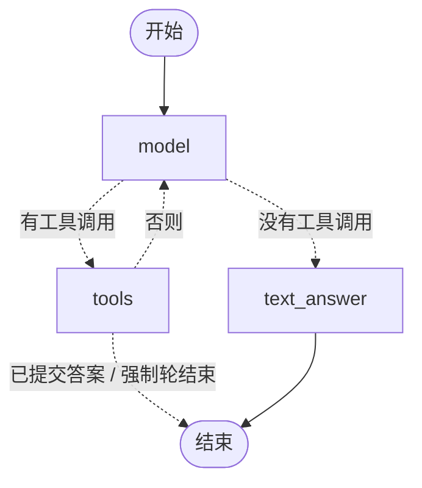

# LangGraph 迁移与忠实度修复 · agent_v2

> 2026-09-26。

## 一、迁移到 LangGraph（`src/agent_graph.py`）

只把“循环”换成状态图，工具、参数校验、提示词、LLM 封装都复用 `src/agent.py`：

**等价性验证**：LangGraph 版重跑 golden_v2 和盲测共 51 题，全部命中缓存（0 次 API 调用），答案、上下文、轨迹、结束方式、token 用量逐字相同。缓存键包含完整对话历史，所以“全部命中”等于证明每一步发给模型的内容都一样。

**迁移中的取舍**

| | 手写循环 | LangGraph |
|---|---|---|
| 代码 | 一个 for 循环，约 40 行 | 3 个节点 + 2 个条件边，约 80 行 |
| 可读性 | 控制流一眼看完 | 图结构清楚，能自动画出流程图 |
| 状态 | 局部变量 | 显式的 State，每个节点返回增量 |
| 对话历史 | dict 列表 | 故意**不用** `add_messages`：LangChain 消息对象会改变序列化结果和缓存键，就没法证明等价了 |
| 不可序列化的对象（Episode、LLM） | 直接用 | 通过 `config["configurable"]` 传入，不放进 State |
| 本项目用到的框架能力 | - | 目前只用了图和条件边；检查点、中断、人工介入、流式输出还没用上 |

结论：在当前规模下，LangGraph 主要换来了结构清晰和可视化，没有减少代码量。等后续加入计算工具、保单查询和人工确认环节时，检查点和中断才会真正发挥价值。

## 二、忠实度修复：提示词 a1 → a2

agent_v1 的问题：答案变长后夹带片段外的补充（3 题不忠实），盲测中 7/18 的回合直接输出文字、没有调用 `final_answer`。

a2 在 a1 后加三条通用规则：每句都要引用、不写片段外的提醒和推测；只答问题问到的内容；必须通过 `final_answer` 提交。另外新增程序指标“没带引用的句子”，不依赖评委。

**预测**：忠实度回到 51/51，文字直接作答减少，答案变短；风险是完整性下降。

| | a1 golden | a2 golden | a1 盲测 | a2 盲测 |
|---|---|---|---|---|
| 可回答题 正确 / 部分 / 错误 | 30 / 0 / 0 | 29 / 1 / 0 | 13 / 1 / 0 | 12 / 2 / 0 |
| 拒答题正确 | 3/3 | 3/3 | 4/4 | 4/4 |
| 忠实度 | 32/33 | 31/33 | 16/18 | **18/18** |
| 平均答案字数 | 471 | **238** | 634 | **452** |
| 没带引用的句子 | 84 | **26** | 80 | **50** |
| 经 final_answer 结束 | 30/33 | **33/33** | 11/18 | **17/18** |
| 平均工具调用 | 4.3 | 4.2 | 5.7 | 5.8 |

逐题：

- 原来 3 个不忠实的答案（q032、b09、b18）全部修好。
- 新增 2 个不忠实：
  - **q027（真错误）**：把国寿的“180 日”错安到太保名下。
  - **q033（评委误判）**：模型说“资料里还包含行业规范”，依据是系统提示的资料范围说明；评委只看得到检索片段，看不到系统提示，因此判为无依据。
- 完整性代价：q030 漏了“条款未使用‘犹豫期’一词”，b12 漏了“阿基米德轻症属于可选保障1”，都是次要要点。

## 结论（AI 建议，学习者 2026-09-26 确认采用 a2）

1. 采用 a2：答案长度减半，没带引用的句子减少一半以上，格式几乎全部合规；代价是 2 题漏了次要要点。保险问答中，说错比漏说更危险。
2. 忠实度问题没有完全消失（q027）。根本做法是在程序里校验：每句话引用的片段里确实出现了句中的关键数字。
3. 评委有一个盲区：看不到系统提示里的资料范围。评委输入里要加上“资料范围”说明。

## 局限

同 agent_v1：盲测已被污染，每个配置只跑一次，评委只经过 15 题校准。
